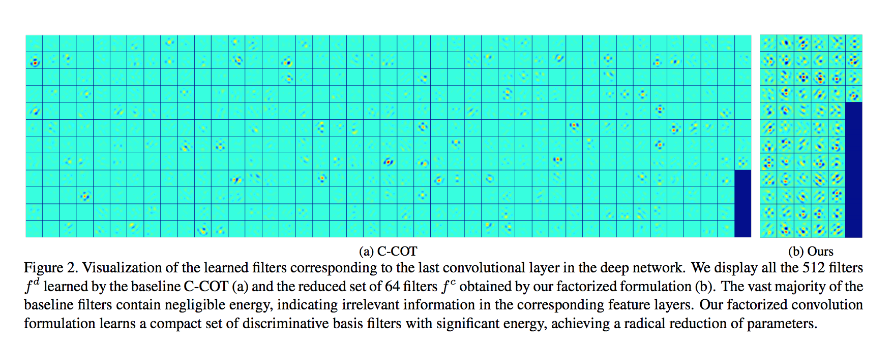
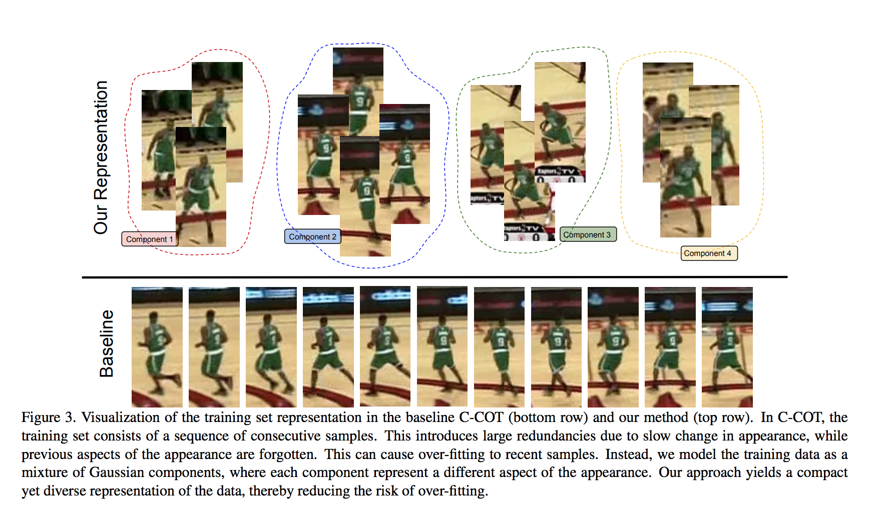

# ECO：Efficient Convolution Operators for Tracking

又是MD大神的一篇好paper。看完之后只能大呼厉害！Abstract部分就各种数据集上刷分了。看了下paper被参数减少80%，训练样本减少90%，迭代减少80%，仍旧在VOT2016上ranked top吓到。Talk is cheap，here we go

## Motivation

在Abstract里面也提到过，本文主要贡献在减少计算复杂度，以及避免一个over-fitting的问题。现在的DCFs的主要问题如下：

- Model size： 以C-COT为baseline，每次更新大约800000个参数，一方面容易over-fitting，另外一方面也严重影响速度。
- Training size：常规的DCFs需要特别多的sample来计算，然而存储是有限的，现在的一些限制训练样本个数的方法也很容易产生**model drift**的情况。
- Model update：**the model is updated in every frame** ,so 选取一个好的更新策略也很关键。

针对上述的几个问题，作者一一给出了解决方法：

- 针对model size： 引入了**factorized convolution operator**操作，有效的减少了模型参数。大约减少了80%的参数。
- 针对trainning size：引入了一个**compact generative model**，减少sample的同时，尽量保证样本的多样性。大约减少了90%的训练样本。
- 针对model update：提出了一个更有效的策略来更新，当然在保证鲁棒性的同时，尽可能提高速度。大约减少了80%的迭代次数。

看到这里这篇paper的主要亮点也就说完了。我读到这里的时候也停下来想过，如果是我，该怎么解决这几个问题。相信看到优化的结果，大家都会有兴趣读下去，那么技术咱们下面接着说。

## Our Approach

### Factorized Convolution Operator

以C-COT为baseline，C-COT是每个特征通道对于一个filter，M为特征就对应M个filter。而作者发现，C-COT的每个filter对应的能量都很少，于是想进行一个降纬操作。ECO只有N个filter，其中N<M。保证ECO下N个filter通过线性组合可以表述C-COT的M个filter，这里的降纬操作可以在第一帧学到一个矩阵**P**，N到M的映射关系用一堆系数来表示。而之后这个矩阵**P**就不再改变。这里很容易想通，在高纬空间中找到了一组基来表述，通过这组基的先行组合可以轻松得到高纬空间中的任意向量。基于这种思考，对特征层进行优化，而可视化后的结果也表明，降维之后的filter大部分都有响应。当然要优化的loss也随之进行了一个改变。

### Generative Sample Space Model

以C-COT为baseline，C-COT的样本策略是限制训练样本的个数上线为M，在每次train之后还会学习每个样本的权重，如果样本总数达到上限，便舍弃权重最低的那个样本。而作者认为，这种策略在没有明显变化时很容易引起over-fitting以及model drift。ECO采用了GMM（混合高斯模型）来生成不同类型的component，每个component对应了一组比较相似的样本。而设置component的个数为L，实验时发现L取M/8比较不错。每次来一个样本，初始化一个component，如果达到上限，就舍弃一个权重低于阈值的component，如果没有低于阈值，就选择合并两个最相似的component，同时作者也给出了合并策略。借此方式在减少sample量的同时，保证sample的多样性，并且减少了over-fitting的可能。

### Model Update Strategy

这里ECO选择每N帧更新一次（实验中N=6），并且每次更新不是用单帧更新，而是采用mini-batch的策略。

**最终在各大数据集上都取得了超赞的结果。**

## Conclusion

ECO这篇paper的整体思路很棒，作者还开源了[matlab代码](https://github.com/martin-danelljan/ECO)。个人觉得效果好的原因有以下几点：

- 采用了CNN以及hog cn的特征，应该说是trackin现在经常用的特征，在减少了计算量后，精度上升是必然。
- 而GMM和更新策略又降低了over-fitting和model drift的可能。

可以说是非常赞的工作了。
